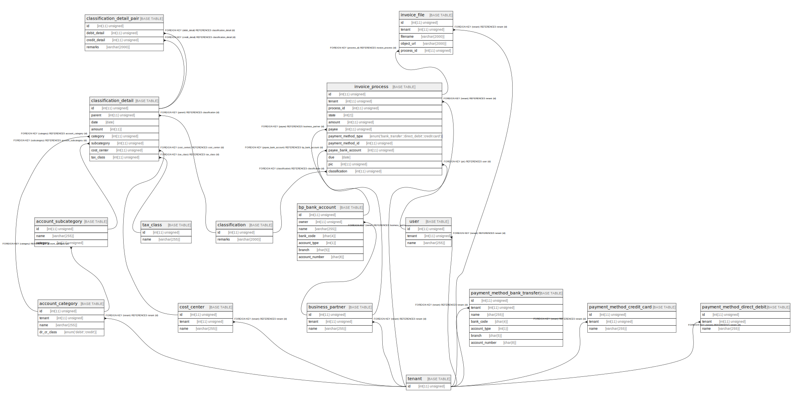

# mysaas

## Tables

| Name | Columns | Comment | Type |
| ---- | ------- | ------- | ---- |
| [account_category](account_category.md) | 4 | 科目。科目は独自に追加できるとして、テナント毎に科目を用意する。 | BASE TABLE |
| [account_subcategory](account_subcategory.md) | 3 | 補助科目 | BASE TABLE |
| [bp_bank_account](bp_bank_account.md) | 7 | 取引先の銀行口座 | BASE TABLE |
| [business_partner](business_partner.md) | 3 | 取引先。請求元や支払い先の個人もしくは法人 | BASE TABLE |
| [classification](classification.md) | 2 | 仕訳. invoice_process にまとめることも考えたが、invoice_process_detail が必要になったので対称性のために仕訳は切り出した。 | BASE TABLE |
| [classification_detail](classification_detail.md) | 8 | 仕訳明細。同一の請求明細であっても貸方借方それぞれのレコードが入る。 | BASE TABLE |
| [classification_detail_pair](classification_detail_pair.md) | 4 | 仕訳明細ペア. 計上日が同じ借方と借方をペアにして摘要を加えるのは、画面特有の概念と思われるので別テーブルで表現する。 | BASE TABLE |
| [cost_center](cost_center.md) | 3 | 会計上の部門 | BASE TABLE |
| [invoice_file](invoice_file.md) | 5 | 請求書ファイル。請求書の中のデータは、構造が取引先によって異なると思われるのでテーブルには入れない。 | BASE TABLE |
| [invoice_process](invoice_process.md) | 12 | 請求書処理。請求書の処理と支払いは一貫して行われるものと想定してまとめている。 | BASE TABLE |
| [payment_method_bank_transfer](payment_method_bank_transfer.md) | 7 | 銀行振り込みによる支払方法. 支払先ではなく、支払い元の銀行口座を示している。支払い方法のカテゴリごとにテーブルを分ける。外部キー制約はつけられないが、ほとんどのフィールドを使わなくて NULL ばかりにならないことを優先する。 | BASE TABLE |
| [payment_method_credit_card](payment_method_credit_card.md) | 3 | クレジットカードによる支払い方法。フィールドは明らかでないので省略する。 | BASE TABLE |
| [payment_method_direct_debit](payment_method_direct_debit.md) | 3 | 自動引落による支払い方法。フィールドは明らかでないので省略する。 | BASE TABLE |
| [tax_class](tax_class.md) | 2 | 税区分. 税率変更を考慮して、ENUM 型で表現せずに別テーブルにする。税区分はテナントによらない。 | BASE TABLE |
| [tenant](tenant.md) | 1 | テナント。主キー以外のフィールドは不明なので省略する。 | BASE TABLE |
| [user](user.md) | 3 | この SaaS サービスを使う人間 | BASE TABLE |

## Relations

---

> Generated by [tbls](https://github.com/k1LoW/tbls)
