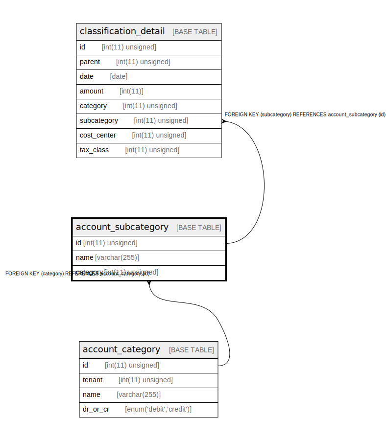

# account_subcategory

## Description

補助科目

<details>
<summary><strong>Table Definition</strong></summary>

```sql
CREATE TABLE `account_subcategory` (
  `id` int(11) unsigned NOT NULL AUTO_INCREMENT COMMENT 'ID',
  `name` varchar(255) COLLATE utf8mb4_bin NOT NULL COMMENT '表示名',
  `category` int(11) unsigned NOT NULL COMMENT '親の科目',
  PRIMARY KEY (`id`),
  UNIQUE KEY `category` (`category`,`name`),
  CONSTRAINT `account_subcategory_ibfk_1` FOREIGN KEY (`category`) REFERENCES `account_category` (`id`)
) ENGINE=InnoDB DEFAULT CHARSET=utf8mb4 COLLATE=utf8mb4_bin COMMENT='補助科目'
```

</details>

## Columns

| Name | Type | Default | Nullable | Extra Definition | Children | Parents | Comment |
| ---- | ---- | ------- | -------- | ---------------- | -------- | ------- | ------- |
| id | int(11) unsigned |  | false | auto_increment | [classification_detail](classification_detail.md) |  | ID |
| name | varchar(255) |  | false |  |  |  | 表示名 |
| category | int(11) unsigned |  | false |  |  | [account_category](account_category.md) | 親の科目 |

## Constraints

| Name | Type | Definition |
| ---- | ---- | ---------- |
| account_subcategory_ibfk_1 | FOREIGN KEY | FOREIGN KEY (category) REFERENCES account_category (id) |
| category | UNIQUE | UNIQUE KEY category (category, name) |
| PRIMARY | PRIMARY KEY | PRIMARY KEY (id) |

## Indexes

| Name | Definition |
| ---- | ---------- |
| PRIMARY | PRIMARY KEY (id) USING BTREE |
| category | UNIQUE KEY category (category, name) USING BTREE |

## Relations



---

> Generated by [tbls](https://github.com/k1LoW/tbls)
