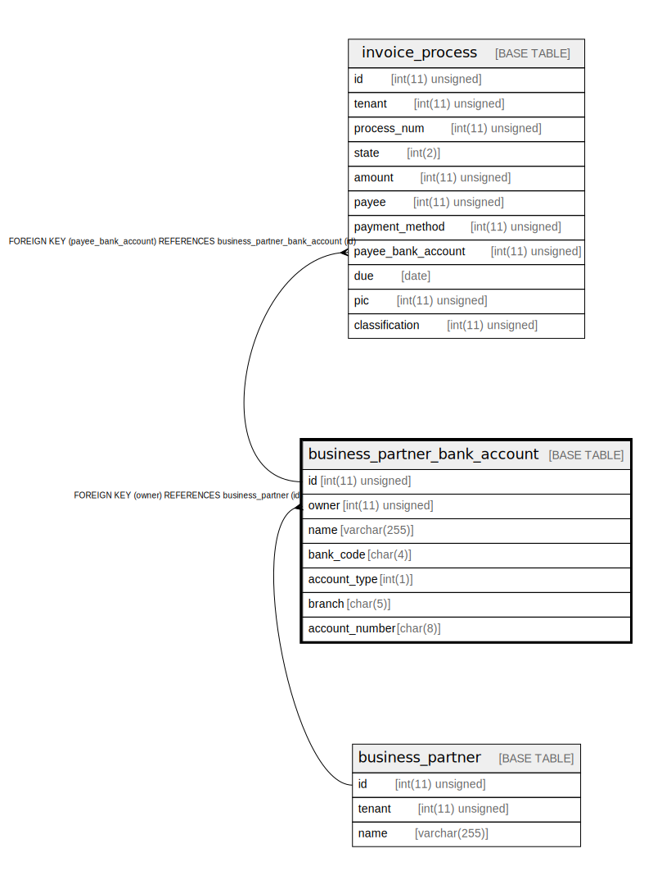

# business_partner_bank_account

## Description

取引先の銀行口座。payment_method_bank_transfer とフィールドは重複するが、共通部分を切り出すと余計なテーブルが増えてクエリが複雑になるので、重複したフィールドをそれぞれに持たせている。また、仮にそれぞれのテーブルに重複した銀行口座があっても、一つに寄せてはならない。

<details>
<summary><strong>Table Definition</strong></summary>

```sql
CREATE TABLE `business_partner_bank_account` (
  `id` int(11) unsigned NOT NULL AUTO_INCREMENT COMMENT 'ID',
  `owner` int(11) unsigned NOT NULL COMMENT '取引先',
  `name` varchar(255) COLLATE utf8mb4_bin NOT NULL COMMENT '表示名',
  `bank_code` char(4) COLLATE utf8mb4_bin NOT NULL COMMENT '銀行コード。銀行コードのマスタが要るが省略する。',
  `account_type` int(1) NOT NULL COMMENT '口座種別',
  `branch` char(5) COLLATE utf8mb4_bin NOT NULL COMMENT '支店番号',
  `account_number` char(8) COLLATE utf8mb4_bin DEFAULT NULL COMMENT '口座番号',
  PRIMARY KEY (`id`),
  UNIQUE KEY `name` (`name`,`owner`),
  UNIQUE KEY `account_number` (`account_number`,`branch`,`bank_code`,`owner`),
  KEY `owner` (`owner`),
  CONSTRAINT `business_partner_bank_account_ibfk_1` FOREIGN KEY (`owner`) REFERENCES `business_partner` (`id`)
) ENGINE=InnoDB DEFAULT CHARSET=utf8mb4 COLLATE=utf8mb4_bin COMMENT='取引先の銀行口座。payment_method_bank_transfer とフィールドは重複するが、共通部分を切り出すと余計なテーブルが増えてクエリが複雑になるので、重複したフィールドをそれぞれに持たせている。また、仮にそれぞれのテーブルに重複した銀行口座があっても、一つに寄せてはならない。'
```

</details>

## Columns

| Name | Type | Default | Nullable | Extra Definition | Children | Parents | Comment |
| ---- | ---- | ------- | -------- | ---------------- | -------- | ------- | ------- |
| id | int(11) unsigned |  | false | auto_increment | [invoice_process](invoice_process.md) |  | ID |
| owner | int(11) unsigned |  | false |  |  | [business_partner](business_partner.md) | 取引先 |
| name | varchar(255) |  | false |  |  |  | 表示名 |
| bank_code | char(4) |  | false |  |  |  | 銀行コード。銀行コードのマスタが要るが省略する。 |
| account_type | int(1) |  | false |  |  |  | 口座種別 |
| branch | char(5) |  | false |  |  |  | 支店番号 |
| account_number | char(8) |  | true |  |  |  | 口座番号 |

## Constraints

| Name | Type | Definition |
| ---- | ---- | ---------- |
| account_number | UNIQUE | UNIQUE KEY account_number (account_number, branch, bank_code, owner) |
| business_partner_bank_account_ibfk_1 | FOREIGN KEY | FOREIGN KEY (owner) REFERENCES business_partner (id) |
| name | UNIQUE | UNIQUE KEY name (name, owner) |
| PRIMARY | PRIMARY KEY | PRIMARY KEY (id) |

## Indexes

| Name | Definition |
| ---- | ---------- |
| owner | KEY owner (owner) USING BTREE |
| PRIMARY | PRIMARY KEY (id) USING BTREE |
| account_number | UNIQUE KEY account_number (account_number, branch, bank_code, owner) USING BTREE |
| name | UNIQUE KEY name (name, owner) USING BTREE |

## Relations



---

> Generated by [tbls](https://github.com/k1LoW/tbls)
