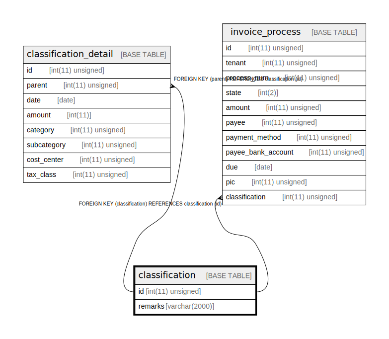

# classification

## Description

仕訳。invoice_process にまとめることも考えたが、invoice_process_detail が必要になったので対称性のために仕訳は切り出した。

<details>
<summary><strong>Table Definition</strong></summary>

```sql
CREATE TABLE `classification` (
  `id` int(11) unsigned NOT NULL AUTO_INCREMENT COMMENT 'ID',
  `remarks` varchar(2000) COLLATE utf8mb4_bin DEFAULT NULL COMMENT '請求メモ',
  PRIMARY KEY (`id`)
) ENGINE=InnoDB DEFAULT CHARSET=utf8mb4 COLLATE=utf8mb4_bin COMMENT='仕訳。invoice_process にまとめることも考えたが、invoice_process_detail が必要になったので対称性のために仕訳は切り出した。'
```

</details>

## Columns

| Name | Type | Default | Nullable | Extra Definition | Children | Parents | Comment |
| ---- | ---- | ------- | -------- | ---------------- | -------- | ------- | ------- |
| id | int(11) unsigned |  | false | auto_increment | [classification_detail](classification_detail.md) [invoice_process](invoice_process.md) |  | ID |
| remarks | varchar(2000) |  | true |  |  |  | 請求メモ |

## Constraints

| Name | Type | Definition |
| ---- | ---- | ---------- |
| PRIMARY | PRIMARY KEY | PRIMARY KEY (id) |

## Indexes

| Name | Definition |
| ---- | ---------- |
| PRIMARY | PRIMARY KEY (id) USING BTREE |

## Relations



---

> Generated by [tbls](https://github.com/k1LoW/tbls)
