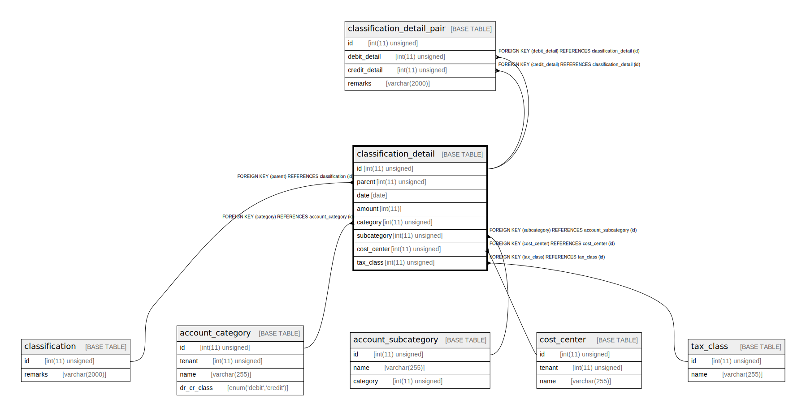

# classification_detail

## Description

仕訳明細。同一の請求明細であっても貸方借方それぞれのレコードが入る。

<details>
<summary><strong>Table Definition</strong></summary>

```sql
CREATE TABLE `classification_detail` (
  `id` int(11) unsigned NOT NULL AUTO_INCREMENT COMMENT 'ID',
  `parent` int(11) unsigned NOT NULL COMMENT '明細の親である仕訳',
  `date` date NOT NULL COMMENT '計上日',
  `amount` int(11) NOT NULL COMMENT '金額。請求を債権と相殺するなどマイナスはありうるので、帳簿上は signed とする。',
  `category` int(11) unsigned NOT NULL COMMENT '勘定科目。科目に借方貸方を設定しているので、科目からこの明細の借方貸方がわかる。',
  `subcategory` int(11) unsigned DEFAULT NULL COMMENT '補助科目',
  `cost_center` int(11) unsigned DEFAULT NULL COMMENT '部門',
  `tax_class` int(11) unsigned NOT NULL COMMENT '税区分',
  PRIMARY KEY (`id`),
  KEY `parent` (`parent`),
  KEY `category` (`category`),
  KEY `subcategory` (`subcategory`),
  KEY `cost_center` (`cost_center`),
  KEY `tax_class` (`tax_class`),
  CONSTRAINT `classification_detail_ibfk_1` FOREIGN KEY (`parent`) REFERENCES `classification` (`id`),
  CONSTRAINT `classification_detail_ibfk_2` FOREIGN KEY (`category`) REFERENCES `account_category` (`id`),
  CONSTRAINT `classification_detail_ibfk_3` FOREIGN KEY (`subcategory`) REFERENCES `account_subcategory` (`id`),
  CONSTRAINT `classification_detail_ibfk_4` FOREIGN KEY (`cost_center`) REFERENCES `cost_center` (`id`),
  CONSTRAINT `classification_detail_ibfk_5` FOREIGN KEY (`tax_class`) REFERENCES `tax_class` (`id`)
) ENGINE=InnoDB DEFAULT CHARSET=utf8mb4 COLLATE=utf8mb4_bin COMMENT='仕訳明細。同一の請求明細であっても貸方借方それぞれのレコードが入る。'
```

</details>

## Columns

| Name | Type | Default | Nullable | Extra Definition | Children | Parents | Comment |
| ---- | ---- | ------- | -------- | ---------------- | -------- | ------- | ------- |
| id | int(11) unsigned |  | false | auto_increment | [classification_detail_pair](classification_detail_pair.md) |  | ID |
| parent | int(11) unsigned |  | false |  |  | [classification](classification.md) | 明細の親である仕訳 |
| date | date |  | false |  |  |  | 計上日 |
| amount | int(11) |  | false |  |  |  | 金額。請求を債権と相殺するなどマイナスはありうるので、帳簿上は signed とする。 |
| category | int(11) unsigned |  | false |  |  | [account_category](account_category.md) | 勘定科目。科目に借方貸方を設定しているので、科目からこの明細の借方貸方がわかる。 |
| subcategory | int(11) unsigned |  | true |  |  | [account_subcategory](account_subcategory.md) | 補助科目 |
| cost_center | int(11) unsigned |  | true |  |  | [cost_center](cost_center.md) | 部門 |
| tax_class | int(11) unsigned |  | false |  |  | [tax_class](tax_class.md) | 税区分 |

## Constraints

| Name | Type | Definition |
| ---- | ---- | ---------- |
| classification_detail_ibfk_1 | FOREIGN KEY | FOREIGN KEY (parent) REFERENCES classification (id) |
| classification_detail_ibfk_2 | FOREIGN KEY | FOREIGN KEY (category) REFERENCES account_category (id) |
| classification_detail_ibfk_3 | FOREIGN KEY | FOREIGN KEY (subcategory) REFERENCES account_subcategory (id) |
| classification_detail_ibfk_4 | FOREIGN KEY | FOREIGN KEY (cost_center) REFERENCES cost_center (id) |
| classification_detail_ibfk_5 | FOREIGN KEY | FOREIGN KEY (tax_class) REFERENCES tax_class (id) |
| PRIMARY | PRIMARY KEY | PRIMARY KEY (id) |

## Indexes

| Name | Definition |
| ---- | ---------- |
| category | KEY category (category) USING BTREE |
| cost_center | KEY cost_center (cost_center) USING BTREE |
| parent | KEY parent (parent) USING BTREE |
| subcategory | KEY subcategory (subcategory) USING BTREE |
| tax_class | KEY tax_class (tax_class) USING BTREE |
| PRIMARY | PRIMARY KEY (id) USING BTREE |

## Relations



---

> Generated by [tbls](https://github.com/k1LoW/tbls)
