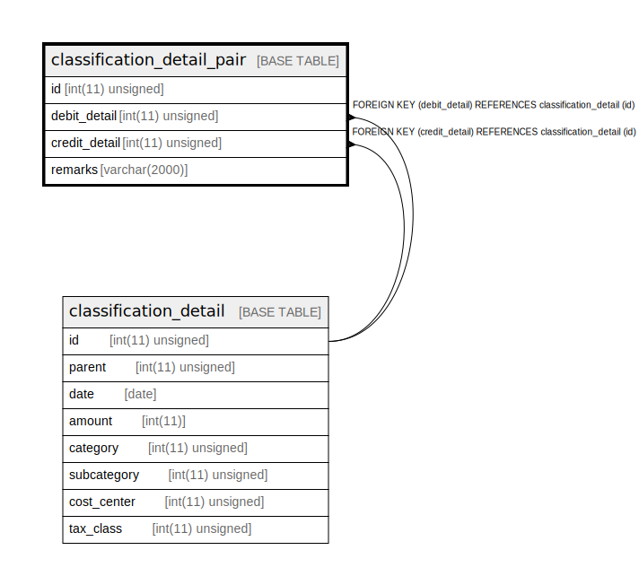

# classification_detail_pair

## Description

仕訳明細ペア。計上日が同じ借方と借方をペアにして摘要を加えるのは、画面特有の概念と思われるので別テーブルで表現する。

<details>
<summary><strong>Table Definition</strong></summary>

```sql
CREATE TABLE `classification_detail_pair` (
  `id` int(11) unsigned NOT NULL AUTO_INCREMENT COMMENT 'ID',
  `debit_detail` int(11) unsigned DEFAULT NULL COMMENT '借方明細。credit_detail と同じ仕訳に属して、計上日も同じ。',
  `credit_detail` int(11) unsigned DEFAULT NULL COMMENT '貸方明細。debit_detail と同じ仕訳に属して、計上日も同じ。',
  `remarks` varchar(2000) COLLATE utf8mb4_bin DEFAULT NULL COMMENT '摘要',
  PRIMARY KEY (`id`),
  UNIQUE KEY `debit_detail` (`debit_detail`),
  UNIQUE KEY `credit_detail` (`credit_detail`),
  CONSTRAINT `classification_detail_pair_ibfk_1` FOREIGN KEY (`debit_detail`) REFERENCES `classification_detail` (`id`),
  CONSTRAINT `classification_detail_pair_ibfk_2` FOREIGN KEY (`credit_detail`) REFERENCES `classification_detail` (`id`)
) ENGINE=InnoDB DEFAULT CHARSET=utf8mb4 COLLATE=utf8mb4_bin COMMENT='仕訳明細ペア。計上日が同じ借方と借方をペアにして摘要を加えるのは、画面特有の概念と思われるので別テーブルで表現する。'
```

</details>

## Columns

| Name | Type | Default | Nullable | Extra Definition | Children | Parents | Comment |
| ---- | ---- | ------- | -------- | ---------------- | -------- | ------- | ------- |
| id | int(11) unsigned |  | false | auto_increment |  |  | ID |
| debit_detail | int(11) unsigned |  | true |  |  | [classification_detail](classification_detail.md) | 借方明細。credit_detail と同じ仕訳に属して、計上日も同じ。 |
| credit_detail | int(11) unsigned |  | true |  |  | [classification_detail](classification_detail.md) | 貸方明細。debit_detail と同じ仕訳に属して、計上日も同じ。 |
| remarks | varchar(2000) |  | true |  |  |  | 摘要 |

## Constraints

| Name | Type | Definition |
| ---- | ---- | ---------- |
| classification_detail_pair_ibfk_1 | FOREIGN KEY | FOREIGN KEY (debit_detail) REFERENCES classification_detail (id) |
| classification_detail_pair_ibfk_2 | FOREIGN KEY | FOREIGN KEY (credit_detail) REFERENCES classification_detail (id) |
| credit_detail | UNIQUE | UNIQUE KEY credit_detail (credit_detail) |
| debit_detail | UNIQUE | UNIQUE KEY debit_detail (debit_detail) |
| PRIMARY | PRIMARY KEY | PRIMARY KEY (id) |

## Indexes

| Name | Definition |
| ---- | ---------- |
| PRIMARY | PRIMARY KEY (id) USING BTREE |
| credit_detail | UNIQUE KEY credit_detail (credit_detail) USING BTREE |
| debit_detail | UNIQUE KEY debit_detail (debit_detail) USING BTREE |

## Relations



---

> Generated by [tbls](https://github.com/k1LoW/tbls)
