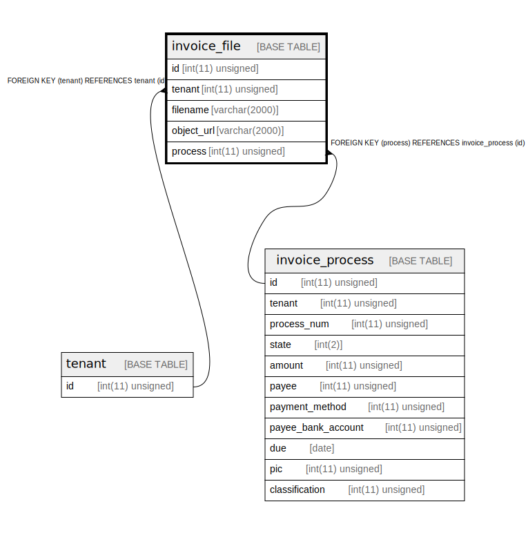

# invoice_file

## Description

請求書ファイル。請求書の中のデータは、構造が取引先によって異なると思われるのでテーブルには入れない。

<details>
<summary><strong>Table Definition</strong></summary>

```sql
CREATE TABLE `invoice_file` (
  `id` int(11) unsigned NOT NULL AUTO_INCREMENT COMMENT 'ID',
  `tenant` int(11) unsigned NOT NULL COMMENT 'テナント',
  `filename` varchar(2000) COLLATE utf8mb4_bin NOT NULL COMMENT 'ファイル名',
  `object_url` varchar(2000) COLLATE utf8mb4_bin NOT NULL COMMENT '請求書のファイルのURL',
  `process` int(11) unsigned DEFAULT NULL COMMENT 'この請求書が処理されるプロセスのID。請求書をアップロードしてから、選択して処理すると推測して nullable にする。',
  PRIMARY KEY (`id`),
  KEY `tenant` (`tenant`),
  KEY `process` (`process`),
  CONSTRAINT `invoice_file_ibfk_1` FOREIGN KEY (`tenant`) REFERENCES `tenant` (`id`),
  CONSTRAINT `invoice_file_ibfk_2` FOREIGN KEY (`process`) REFERENCES `invoice_process` (`id`)
) ENGINE=InnoDB DEFAULT CHARSET=utf8mb4 COLLATE=utf8mb4_bin COMMENT='請求書ファイル。請求書の中のデータは、構造が取引先によって異なると思われるのでテーブルには入れない。'
```

</details>

## Columns

| Name | Type | Default | Nullable | Extra Definition | Children | Parents | Comment |
| ---- | ---- | ------- | -------- | ---------------- | -------- | ------- | ------- |
| id | int(11) unsigned |  | false | auto_increment |  |  | ID |
| tenant | int(11) unsigned |  | false |  |  | [tenant](tenant.md) | テナント |
| filename | varchar(2000) |  | false |  |  |  | ファイル名 |
| object_url | varchar(2000) |  | false |  |  |  | 請求書のファイルのURL |
| process | int(11) unsigned |  | true |  |  | [invoice_process](invoice_process.md) | この請求書が処理されるプロセスのID。請求書をアップロードしてから、選択して処理すると推測して nullable にする。 |

## Constraints

| Name | Type | Definition |
| ---- | ---- | ---------- |
| invoice_file_ibfk_1 | FOREIGN KEY | FOREIGN KEY (tenant) REFERENCES tenant (id) |
| invoice_file_ibfk_2 | FOREIGN KEY | FOREIGN KEY (process) REFERENCES invoice_process (id) |
| PRIMARY | PRIMARY KEY | PRIMARY KEY (id) |

## Indexes

| Name | Definition |
| ---- | ---------- |
| process | KEY process (process) USING BTREE |
| tenant | KEY tenant (tenant) USING BTREE |
| PRIMARY | PRIMARY KEY (id) USING BTREE |

## Relations



---

> Generated by [tbls](https://github.com/k1LoW/tbls)
