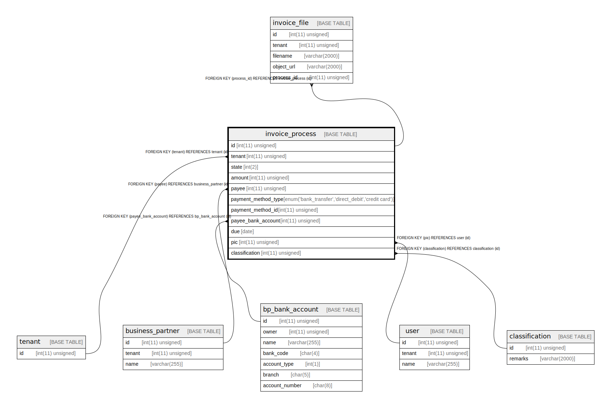

# invoice_process

## Description

請求書処理。請求書の処理と支払いは一貫して行われるものと想定してまとめている。

<details>
<summary><strong>Table Definition</strong></summary>

```sql
CREATE TABLE `invoice_process` (
  `id` int(11) unsigned NOT NULL AUTO_INCREMENT COMMENT 'ID。(tenant, process_id) で複合主キーにすると他のテーブルとJOINするのが面倒なのと、後続の支払い処理で一意な識別子がないと不便そうなのでサロゲートキーをつかう。',
  `tenant` int(11) unsigned NOT NULL COMMENT 'テナント',
  `process_id` int(11) unsigned NOT NULL COMMENT 'テナント内で使われる請求書処理の通番。画面の No. に使う。',
  `state` int(2) NOT NULL COMMENT '状態。未処理、削除済、処理中（細かい状態があるかも）、処理済みは必要。',
  `amount` int(11) unsigned NOT NULL COMMENT '金額。支払いがマイナスにはならないので、unsigned とする。',
  `payee` int(11) unsigned NOT NULL COMMENT '支払先取引先',
  `payment_method_type` enum('bank_transfer','direct_debit','credit card') COLLATE utf8mb4_bin NOT NULL COMMENT '支払い方法種別',
  `payment_method_id` int(11) unsigned NOT NULL COMMENT '支払い方法。payment_method_type が示すテーブルのID。外部キー制約はつけられない。',
  `payee_bank_account` int(11) unsigned DEFAULT NULL COMMENT '振込先口座. payment_method_type=bank_transfer のときのみ値がある',
  `due` date NOT NULL COMMENT '支払期日',
  `pic` int(11) unsigned NOT NULL COMMENT '担当者',
  `classification` int(11) unsigned NOT NULL COMMENT '仕訳',
  PRIMARY KEY (`id`),
  UNIQUE KEY `tenant` (`tenant`,`process_id`),
  KEY `payee` (`payee`),
  KEY `payee_bank_account` (`payee_bank_account`),
  KEY `pic` (`pic`),
  KEY `classification` (`classification`),
  CONSTRAINT `invoice_process_ibfk_1` FOREIGN KEY (`tenant`) REFERENCES `tenant` (`id`),
  CONSTRAINT `invoice_process_ibfk_2` FOREIGN KEY (`payee`) REFERENCES `business_partner` (`id`),
  CONSTRAINT `invoice_process_ibfk_3` FOREIGN KEY (`payee_bank_account`) REFERENCES `bp_bank_account` (`id`),
  CONSTRAINT `invoice_process_ibfk_4` FOREIGN KEY (`pic`) REFERENCES `user` (`id`),
  CONSTRAINT `invoice_process_ibfk_5` FOREIGN KEY (`classification`) REFERENCES `classification` (`id`)
) ENGINE=InnoDB DEFAULT CHARSET=utf8mb4 COLLATE=utf8mb4_bin COMMENT='請求書処理。請求書の処理と支払いは一貫して行われるものと想定してまとめている。'
```

</details>

## Columns

| Name | Type | Default | Nullable | Extra Definition | Children | Parents | Comment |
| ---- | ---- | ------- | -------- | ---------------- | -------- | ------- | ------- |
| id | int(11) unsigned |  | false | auto_increment | [invoice_file](invoice_file.md) |  | ID。(tenant, process_id) で複合主キーにすると他のテーブルとJOINするのが面倒なのと、後続の支払い処理で一意な識別子がないと不便そうなのでサロゲートキーをつかう。 |
| tenant | int(11) unsigned |  | false |  |  | [tenant](tenant.md) | テナント |
| process_id | int(11) unsigned |  | false |  |  |  | テナント内で使われる請求書処理の通番。画面の No. に使う。 |
| state | int(2) |  | false |  |  |  | 状態。未処理、削除済、処理中（細かい状態があるかも）、処理済みは必要。 |
| amount | int(11) unsigned |  | false |  |  |  | 金額。支払いがマイナスにはならないので、unsigned とする。 |
| payee | int(11) unsigned |  | false |  |  | [business_partner](business_partner.md) | 支払先取引先 |
| payment_method_type | enum('bank_transfer','direct_debit','credit card') |  | false |  |  |  | 支払い方法種別 |
| payment_method_id | int(11) unsigned |  | false |  |  |  | 支払い方法。payment_method_type が示すテーブルのID。外部キー制約はつけられない。 |
| payee_bank_account | int(11) unsigned |  | true |  |  | [bp_bank_account](bp_bank_account.md) | 振込先口座. payment_method_type=bank_transfer のときのみ値がある |
| due | date |  | false |  |  |  | 支払期日 |
| pic | int(11) unsigned |  | false |  |  | [user](user.md) | 担当者 |
| classification | int(11) unsigned |  | false |  |  | [classification](classification.md) | 仕訳 |

## Constraints

| Name | Type | Definition |
| ---- | ---- | ---------- |
| invoice_process_ibfk_1 | FOREIGN KEY | FOREIGN KEY (tenant) REFERENCES tenant (id) |
| invoice_process_ibfk_2 | FOREIGN KEY | FOREIGN KEY (payee) REFERENCES business_partner (id) |
| invoice_process_ibfk_3 | FOREIGN KEY | FOREIGN KEY (payee_bank_account) REFERENCES bp_bank_account (id) |
| invoice_process_ibfk_4 | FOREIGN KEY | FOREIGN KEY (pic) REFERENCES user (id) |
| invoice_process_ibfk_5 | FOREIGN KEY | FOREIGN KEY (classification) REFERENCES classification (id) |
| PRIMARY | PRIMARY KEY | PRIMARY KEY (id) |
| tenant | UNIQUE | UNIQUE KEY tenant (tenant, process_id) |

## Indexes

| Name | Definition |
| ---- | ---------- |
| classification | KEY classification (classification) USING BTREE |
| payee | KEY payee (payee) USING BTREE |
| payee_bank_account | KEY payee_bank_account (payee_bank_account) USING BTREE |
| pic | KEY pic (pic) USING BTREE |
| PRIMARY | PRIMARY KEY (id) USING BTREE |
| tenant | UNIQUE KEY tenant (tenant, process_id) USING BTREE |

## Relations



---

> Generated by [tbls](https://github.com/k1LoW/tbls)
