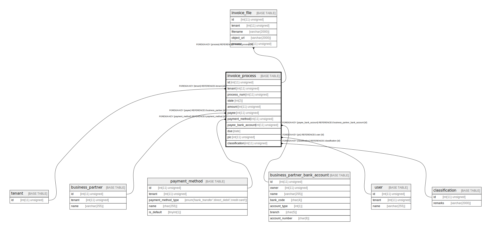

# invoice_process

## Description

請求書処理のワークフロー。請求書の処理と支払いは一貫して行われるものと想定してまとめている。

<details>
<summary><strong>Table Definition</strong></summary>

```sql
CREATE TABLE `invoice_process` (
  `id` int(11) unsigned NOT NULL AUTO_INCREMENT COMMENT 'ID。(tenant, process_num) で複合主キーにすると他のテーブルとJOINするのが面倒なのと、後続の支払い処理で一意な識別子がないと不便そうなのでサロゲートキーをつかう。',
  `tenant` int(11) unsigned NOT NULL COMMENT 'テナント',
  `process_num` int(11) unsigned NOT NULL COMMENT 'テナント内で使われる請求書処理の通番。画面の No. に使う。',
  `state` int(2) NOT NULL COMMENT 'ワークフローの状態を示す値。状態に対する要件が不明なので値で表現しておく。少なくとも未処理、削除済、処理中、処理済みの状態は必要だろう。',
  `amount` int(11) unsigned NOT NULL COMMENT '金額。支払いがマイナスにはならないので、unsigned とする。',
  `payee` int(11) unsigned NOT NULL COMMENT '支払先取引先',
  `payment_method` int(11) unsigned NOT NULL COMMENT '支払い方法',
  `payee_bank_account` int(11) unsigned DEFAULT NULL COMMENT '振込先口座。payment_method_type=bank_transfer のときのみ値がある。',
  `due` date NOT NULL COMMENT '支払期日',
  `pic` int(11) unsigned NOT NULL COMMENT '担当者',
  `classification` int(11) unsigned NOT NULL COMMENT '仕訳',
  PRIMARY KEY (`id`),
  UNIQUE KEY `process_num` (`process_num`,`tenant`),
  UNIQUE KEY `classification` (`classification`),
  KEY `tenant` (`tenant`),
  KEY `payee` (`payee`),
  KEY `payment_method` (`payment_method`),
  KEY `payee_bank_account` (`payee_bank_account`),
  KEY `pic` (`pic`),
  CONSTRAINT `invoice_process_ibfk_1` FOREIGN KEY (`tenant`) REFERENCES `tenant` (`id`),
  CONSTRAINT `invoice_process_ibfk_2` FOREIGN KEY (`payee`) REFERENCES `business_partner` (`id`),
  CONSTRAINT `invoice_process_ibfk_3` FOREIGN KEY (`payment_method`) REFERENCES `payment_method` (`id`),
  CONSTRAINT `invoice_process_ibfk_4` FOREIGN KEY (`payee_bank_account`) REFERENCES `business_partner_bank_account` (`id`),
  CONSTRAINT `invoice_process_ibfk_5` FOREIGN KEY (`pic`) REFERENCES `user` (`id`),
  CONSTRAINT `invoice_process_ibfk_6` FOREIGN KEY (`classification`) REFERENCES `classification` (`id`)
) ENGINE=InnoDB DEFAULT CHARSET=utf8mb4 COLLATE=utf8mb4_bin COMMENT='請求書処理のワークフロー。請求書の処理と支払いは一貫して行われるものと想定してまとめている。'
```

</details>

## Columns

| Name | Type | Default | Nullable | Extra Definition | Children | Parents | Comment |
| ---- | ---- | ------- | -------- | ---------------- | -------- | ------- | ------- |
| id | int(11) unsigned |  | false | auto_increment | [invoice_file](invoice_file.md) |  | ID。(tenant, process_num) で複合主キーにすると他のテーブルとJOINするのが面倒なのと、後続の支払い処理で一意な識別子がないと不便そうなのでサロゲートキーをつかう。 |
| tenant | int(11) unsigned |  | false |  |  | [tenant](tenant.md) | テナント |
| process_num | int(11) unsigned |  | false |  |  |  | テナント内で使われる請求書処理の通番。画面の No. に使う。 |
| state | int(2) |  | false |  |  |  | ワークフローの状態を示す値。状態に対する要件が不明なので値で表現しておく。少なくとも未処理、削除済、処理中、処理済みの状態は必要だろう。 |
| amount | int(11) unsigned |  | false |  |  |  | 金額。支払いがマイナスにはならないので、unsigned とする。 |
| payee | int(11) unsigned |  | false |  |  | [business_partner](business_partner.md) | 支払先取引先 |
| payment_method | int(11) unsigned |  | false |  |  | [payment_method](payment_method.md) | 支払い方法 |
| payee_bank_account | int(11) unsigned |  | true |  |  | [business_partner_bank_account](business_partner_bank_account.md) | 振込先口座。payment_method_type=bank_transfer のときのみ値がある。 |
| due | date |  | false |  |  |  | 支払期日 |
| pic | int(11) unsigned |  | false |  |  | [user](user.md) | 担当者 |
| classification | int(11) unsigned |  | false |  |  | [classification](classification.md) | 仕訳 |

## Constraints

| Name | Type | Definition |
| ---- | ---- | ---------- |
| classification | UNIQUE | UNIQUE KEY classification (classification) |
| invoice_process_ibfk_1 | FOREIGN KEY | FOREIGN KEY (tenant) REFERENCES tenant (id) |
| invoice_process_ibfk_2 | FOREIGN KEY | FOREIGN KEY (payee) REFERENCES business_partner (id) |
| invoice_process_ibfk_3 | FOREIGN KEY | FOREIGN KEY (payment_method) REFERENCES payment_method (id) |
| invoice_process_ibfk_4 | FOREIGN KEY | FOREIGN KEY (payee_bank_account) REFERENCES business_partner_bank_account (id) |
| invoice_process_ibfk_5 | FOREIGN KEY | FOREIGN KEY (pic) REFERENCES user (id) |
| invoice_process_ibfk_6 | FOREIGN KEY | FOREIGN KEY (classification) REFERENCES classification (id) |
| PRIMARY | PRIMARY KEY | PRIMARY KEY (id) |
| process_num | UNIQUE | UNIQUE KEY process_num (process_num, tenant) |

## Indexes

| Name | Definition |
| ---- | ---------- |
| payee | KEY payee (payee) USING BTREE |
| payee_bank_account | KEY payee_bank_account (payee_bank_account) USING BTREE |
| payment_method | KEY payment_method (payment_method) USING BTREE |
| pic | KEY pic (pic) USING BTREE |
| tenant | KEY tenant (tenant) USING BTREE |
| PRIMARY | PRIMARY KEY (id) USING BTREE |
| classification | UNIQUE KEY classification (classification) USING BTREE |
| process_num | UNIQUE KEY process_num (process_num, tenant) USING BTREE |

## Relations



---

> Generated by [tbls](https://github.com/k1LoW/tbls)
