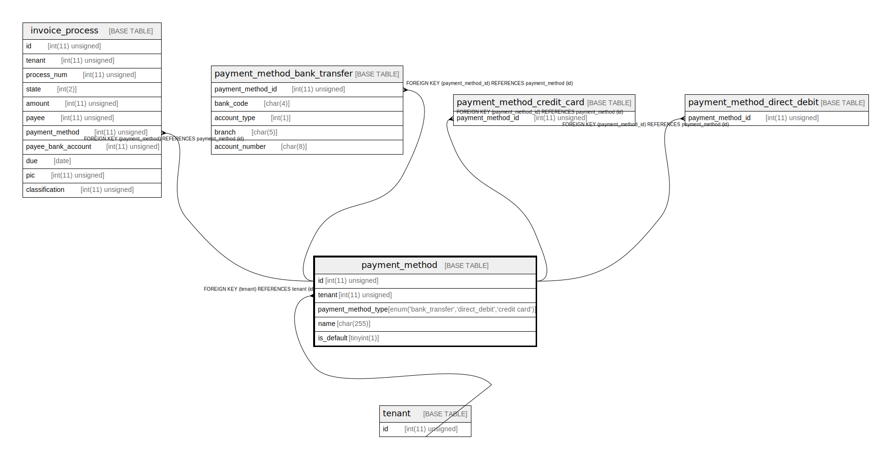

# payment_method

## Description

支払い方法。具体的な支払い方法は支払いカテゴリごとに別テーブルにもち、このテーブルを参照する。is_default のような共通のフィールドはこのテーブルに置く。

<details>
<summary><strong>Table Definition</strong></summary>

```sql
CREATE TABLE `payment_method` (
  `id` int(11) unsigned NOT NULL AUTO_INCREMENT COMMENT 'ID',
  `tenant` int(11) unsigned NOT NULL COMMENT 'テナント',
  `payment_method_type` enum('bank_transfer','direct_debit','credit card') COLLATE utf8mb4_bin NOT NULL COMMENT '支払い方法種別。この種別の支払い方法のテーブルのみこのレコードには参照をもつ。',
  `name` char(255) COLLATE utf8mb4_bin NOT NULL COMMENT '表示名',
  `is_default` tinyint(1) NOT NULL COMMENT '既定の支払い方法か否かを表すフラグ。テナントごとに１つデフォルトがある。',
  PRIMARY KEY (`id`),
  UNIQUE KEY `name` (`name`,`tenant`),
  KEY `tenant` (`tenant`),
  CONSTRAINT `payment_method_ibfk_1` FOREIGN KEY (`tenant`) REFERENCES `tenant` (`id`)
) ENGINE=InnoDB DEFAULT CHARSET=utf8mb4 COLLATE=utf8mb4_bin COMMENT='支払い方法。具体的な支払い方法は支払いカテゴリごとに別テーブルにもち、このテーブルを参照する。is_default のような共通のフィールドはこのテーブルに置く。'
```

</details>

## Columns

| Name | Type | Default | Nullable | Extra Definition | Children | Parents | Comment |
| ---- | ---- | ------- | -------- | ---------------- | -------- | ------- | ------- |
| id | int(11) unsigned |  | false | auto_increment | [invoice_process](invoice_process.md) [payment_method_bank_transfer](payment_method_bank_transfer.md) [payment_method_credit_card](payment_method_credit_card.md) [payment_method_direct_debit](payment_method_direct_debit.md) |  | ID |
| tenant | int(11) unsigned |  | false |  |  | [tenant](tenant.md) | テナント |
| payment_method_type | enum('bank_transfer','direct_debit','credit card') |  | false |  |  |  | 支払い方法種別。この種別の支払い方法のテーブルのみこのレコードには参照をもつ。 |
| name | char(255) |  | false |  |  |  | 表示名 |
| is_default | tinyint(1) |  | false |  |  |  | 既定の支払い方法か否かを表すフラグ。テナントごとに１つデフォルトがある。 |

## Constraints

| Name | Type | Definition |
| ---- | ---- | ---------- |
| name | UNIQUE | UNIQUE KEY name (name, tenant) |
| payment_method_ibfk_1 | FOREIGN KEY | FOREIGN KEY (tenant) REFERENCES tenant (id) |
| PRIMARY | PRIMARY KEY | PRIMARY KEY (id) |

## Indexes

| Name | Definition |
| ---- | ---------- |
| tenant | KEY tenant (tenant) USING BTREE |
| PRIMARY | PRIMARY KEY (id) USING BTREE |
| name | UNIQUE KEY name (name, tenant) USING BTREE |

## Relations



---

> Generated by [tbls](https://github.com/k1LoW/tbls)
