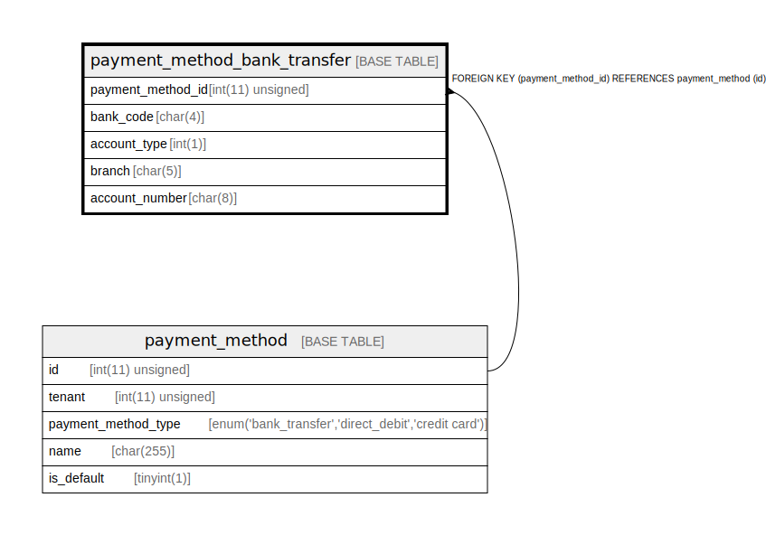

# payment_method_bank_transfer

## Description

銀行振り込みによる支払方法。支払先ではなく、支払い元の銀行口座を示している。支払い方法のカテゴリごとにテーブルを分ける。この結果外部キー制約はつけられない。一方で、すべての支払い種別を一つのテーブルで表現すると、フィールドがNULLばかりになり、また支払い種別の追加が難しくなる。

<details>
<summary><strong>Table Definition</strong></summary>

```sql
CREATE TABLE `payment_method_bank_transfer` (
  `payment_method_id` int(11) unsigned NOT NULL COMMENT '支払い方法ID。payment_method テーブルの主キーと同一の値である。',
  `bank_code` char(4) COLLATE utf8mb4_bin NOT NULL COMMENT '銀行コード。銀行コードのマスタが要るが省略する。',
  `account_type` int(1) NOT NULL COMMENT '口座種別',
  `branch` char(5) COLLATE utf8mb4_bin NOT NULL COMMENT '支店番号',
  `account_number` char(8) COLLATE utf8mb4_bin NOT NULL COMMENT '口座番号',
  PRIMARY KEY (`payment_method_id`),
  CONSTRAINT `payment_method_bank_transfer_ibfk_1` FOREIGN KEY (`payment_method_id`) REFERENCES `payment_method` (`id`)
) ENGINE=InnoDB DEFAULT CHARSET=utf8mb4 COLLATE=utf8mb4_bin COMMENT='銀行振り込みによる支払方法。支払先ではなく、支払い元の銀行口座を示している。支払い方法のカテゴリごとにテーブルを分ける。この結果外部キー制約はつけられない。一方で、すべての支払い種別を一つのテーブルで表現すると、フィールドがNULLばかりになり、また支払い種別の追加が難しくなる。'
```

</details>

## Columns

| Name | Type | Default | Nullable | Children | Parents | Comment |
| ---- | ---- | ------- | -------- | -------- | ------- | ------- |
| payment_method_id | int(11) unsigned |  | false |  | [payment_method](payment_method.md) | 支払い方法ID。payment_method テーブルの主キーと同一の値である。 |
| bank_code | char(4) |  | false |  |  | 銀行コード。銀行コードのマスタが要るが省略する。 |
| account_type | int(1) |  | false |  |  | 口座種別 |
| branch | char(5) |  | false |  |  | 支店番号 |
| account_number | char(8) |  | false |  |  | 口座番号 |

## Constraints

| Name | Type | Definition |
| ---- | ---- | ---------- |
| payment_method_bank_transfer_ibfk_1 | FOREIGN KEY | FOREIGN KEY (payment_method_id) REFERENCES payment_method (id) |
| PRIMARY | PRIMARY KEY | PRIMARY KEY (payment_method_id) |

## Indexes

| Name | Definition |
| ---- | ---------- |
| PRIMARY | PRIMARY KEY (payment_method_id) USING BTREE |

## Relations



---

> Generated by [tbls](https://github.com/k1LoW/tbls)
