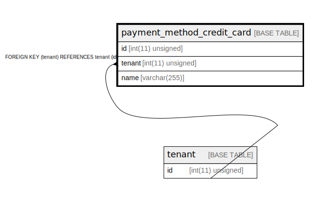

# payment_method_credit_card

## Description

クレジットカードによる支払い方法。フィールドは明らかでないので省略する。

<details>
<summary><strong>Table Definition</strong></summary>

```sql
CREATE TABLE `payment_method_credit_card` (
  `id` int(11) unsigned NOT NULL AUTO_INCREMENT COMMENT 'ID',
  `tenant` int(11) unsigned NOT NULL COMMENT 'テナント',
  `name` varchar(255) COLLATE utf8mb4_bin NOT NULL COMMENT '表示名',
  PRIMARY KEY (`id`),
  KEY `tenant` (`tenant`),
  CONSTRAINT `payment_method_credit_card_ibfk_1` FOREIGN KEY (`tenant`) REFERENCES `tenant` (`id`)
) ENGINE=InnoDB DEFAULT CHARSET=utf8mb4 COLLATE=utf8mb4_bin COMMENT='クレジットカードによる支払い方法。フィールドは明らかでないので省略する。'
```

</details>

## Columns

| Name | Type | Default | Nullable | Extra Definition | Children | Parents | Comment |
| ---- | ---- | ------- | -------- | ---------------- | -------- | ------- | ------- |
| id | int(11) unsigned |  | false | auto_increment |  |  | ID |
| tenant | int(11) unsigned |  | false |  |  | [tenant](tenant.md) | テナント |
| name | varchar(255) |  | false |  |  |  | 表示名 |

## Constraints

| Name | Type | Definition |
| ---- | ---- | ---------- |
| payment_method_credit_card_ibfk_1 | FOREIGN KEY | FOREIGN KEY (tenant) REFERENCES tenant (id) |
| PRIMARY | PRIMARY KEY | PRIMARY KEY (id) |

## Indexes

| Name | Definition |
| ---- | ---------- |
| tenant | KEY tenant (tenant) USING BTREE |
| PRIMARY | PRIMARY KEY (id) USING BTREE |

## Relations



---

> Generated by [tbls](https://github.com/k1LoW/tbls)
