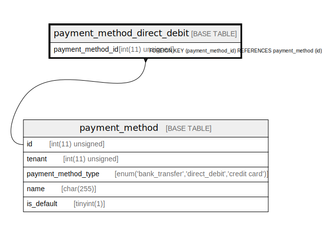

# payment_method_direct_debit

## Description

自動引落による支払い方法。フィールドは明らかでないので省略する。

<details>
<summary><strong>Table Definition</strong></summary>

```sql
CREATE TABLE `payment_method_direct_debit` (
  `payment_method_id` int(11) unsigned NOT NULL COMMENT '支払い方法ID。payment_method テーブルの主キーと同一の値である。',
  PRIMARY KEY (`payment_method_id`),
  CONSTRAINT `payment_method_direct_debit_ibfk_1` FOREIGN KEY (`payment_method_id`) REFERENCES `payment_method` (`id`)
) ENGINE=InnoDB DEFAULT CHARSET=utf8mb4 COLLATE=utf8mb4_bin COMMENT='自動引落による支払い方法。フィールドは明らかでないので省略する。'
```

</details>

## Columns

| Name | Type | Default | Nullable | Children | Parents | Comment |
| ---- | ---- | ------- | -------- | -------- | ------- | ------- |
| payment_method_id | int(11) unsigned |  | false |  | [payment_method](payment_method.md) | 支払い方法ID。payment_method テーブルの主キーと同一の値である。 |

## Constraints

| Name | Type | Definition |
| ---- | ---- | ---------- |
| payment_method_direct_debit_ibfk_1 | FOREIGN KEY | FOREIGN KEY (payment_method_id) REFERENCES payment_method (id) |
| PRIMARY | PRIMARY KEY | PRIMARY KEY (payment_method_id) |

## Indexes

| Name | Definition |
| ---- | ---------- |
| PRIMARY | PRIMARY KEY (payment_method_id) USING BTREE |

## Relations



---

> Generated by [tbls](https://github.com/k1LoW/tbls)
