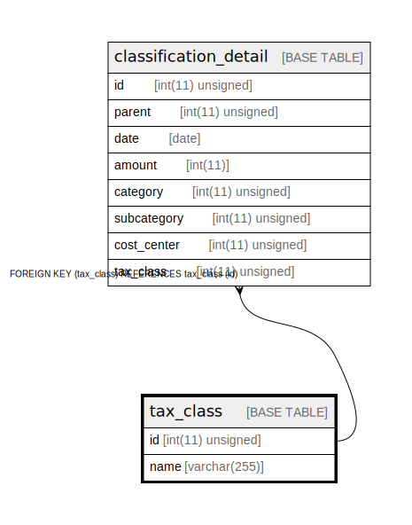

# tax_class

## Description

税区分。税率変更や属性値の追加を考慮して、ENUM で表現せずに別テーブルにする。税区分はテナントによらない。

<details>
<summary><strong>Table Definition</strong></summary>

```sql
CREATE TABLE `tax_class` (
  `id` int(11) unsigned NOT NULL AUTO_INCREMENT COMMENT 'ID',
  `name` varchar(255) COLLATE utf8mb4_bin NOT NULL COMMENT '表示名',
  PRIMARY KEY (`id`),
  UNIQUE KEY `name` (`name`)
) ENGINE=InnoDB DEFAULT CHARSET=utf8mb4 COLLATE=utf8mb4_bin COMMENT='税区分。税率変更や属性値の追加を考慮して、ENUM で表現せずに別テーブルにする。税区分はテナントによらない。'
```

</details>

## Columns

| Name | Type | Default | Nullable | Extra Definition | Children | Parents | Comment |
| ---- | ---- | ------- | -------- | ---------------- | -------- | ------- | ------- |
| id | int(11) unsigned |  | false | auto_increment | [classification_detail](classification_detail.md) |  | ID |
| name | varchar(255) |  | false |  |  |  | 表示名 |

## Constraints

| Name | Type | Definition |
| ---- | ---- | ---------- |
| name | UNIQUE | UNIQUE KEY name (name) |
| PRIMARY | PRIMARY KEY | PRIMARY KEY (id) |

## Indexes

| Name | Definition |
| ---- | ---------- |
| PRIMARY | PRIMARY KEY (id) USING BTREE |
| name | UNIQUE KEY name (name) USING BTREE |

## Relations



---

> Generated by [tbls](https://github.com/k1LoW/tbls)
