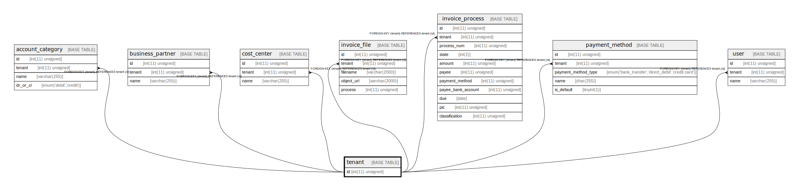

# tenant

## Description

テナント。主キー以外のフィールドは不明なので省略する。

<details>
<summary><strong>Table Definition</strong></summary>

```sql
CREATE TABLE `tenant` (
  `id` int(11) unsigned NOT NULL AUTO_INCREMENT COMMENT 'ID',
  PRIMARY KEY (`id`)
) ENGINE=InnoDB DEFAULT CHARSET=utf8mb4 COLLATE=utf8mb4_bin COMMENT='テナント。主キー以外のフィールドは不明なので省略する。'
```

</details>

## Columns

| Name | Type | Default | Nullable | Extra Definition | Children | Parents | Comment |
| ---- | ---- | ------- | -------- | ---------------- | -------- | ------- | ------- |
| id | int(11) unsigned |  | false | auto_increment | [account_category](account_category.md) [business_partner](business_partner.md) [cost_center](cost_center.md) [invoice_file](invoice_file.md) [invoice_process](invoice_process.md) [payment_method](payment_method.md) [user](user.md) |  | ID |

## Constraints

| Name | Type | Definition |
| ---- | ---- | ---------- |
| PRIMARY | PRIMARY KEY | PRIMARY KEY (id) |

## Indexes

| Name | Definition |
| ---- | ---------- |
| PRIMARY | PRIMARY KEY (id) USING BTREE |

## Relations



---

> Generated by [tbls](https://github.com/k1LoW/tbls)
